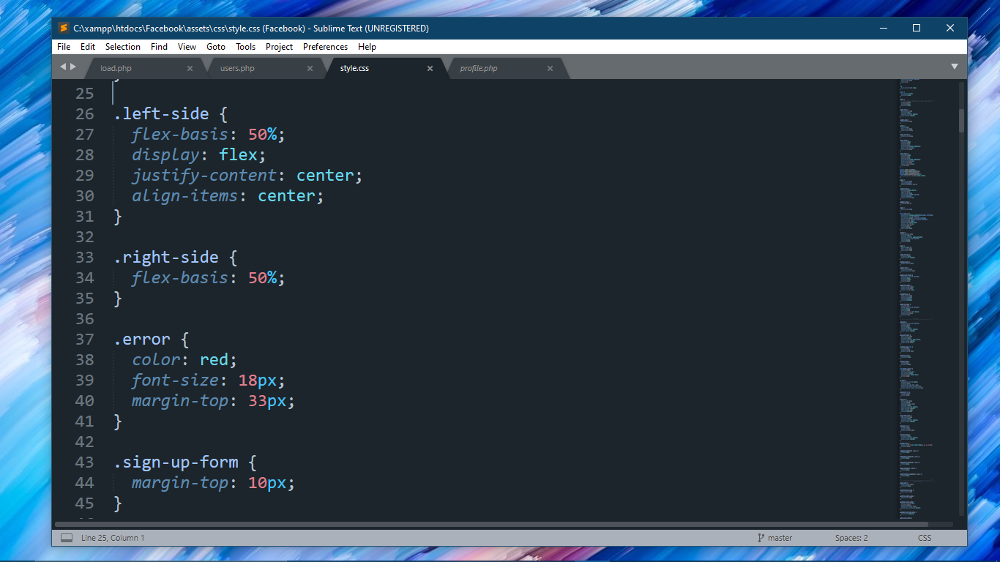

<h1 align="center">Welcome to The Auro Theme👋</h1>
<p>
  
  <a href="#" target="_blank">
    
  </a>
</p>

> This is a really cool sublime text theme which  uses  the colors blue and black and its like the city lights theme Vscode theme

## Install

```sh
$ git clone  https://github.com/Ryan-da-ghost/Auro-theme
```

## Demo
</img>

## Author

👤 **Ryan-the-ghost**


## Show your support

Give a ⭐️ if this project helped you!

***
_This README was generated with ❤️ by [readme-md-generator](https://github.com/kefranabg/readme-md-generator)_
